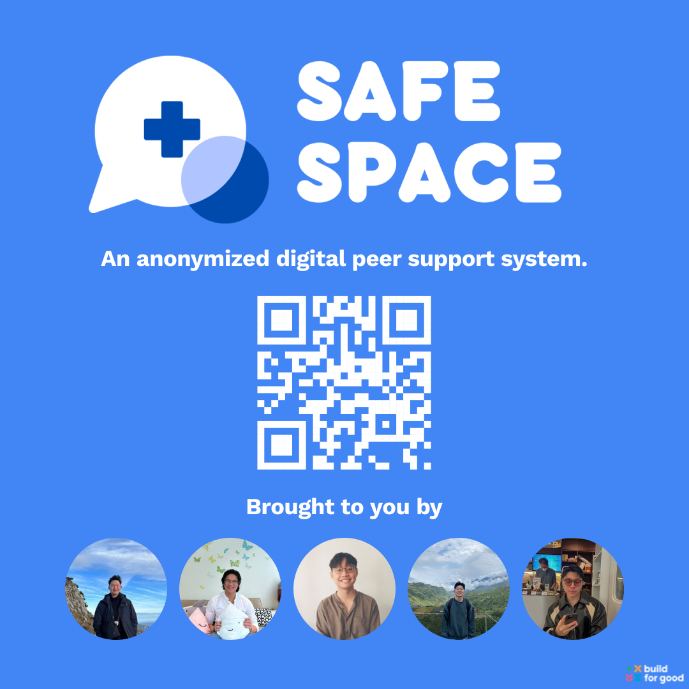

# Build For Good - SafeSpace

SafeSpace, an anonymized digital peer support system using zero knowledge proof meant to help students in Singapore cope with the mental health challenges of they face.

### [Watch our Pitch!](https://www.youtube.com/live/ayP_BzZqQds?feature=share&t=1514)

### [Try it out on Telegram! @SafeSpaceSG_bot](https://t.me/SafeSpaceSG_bot)

-----

# 🏆 Most Touching Soution - Public Voting Category🏆


-----


-----
### Getting Started
```
docker build -t buildforgoodsafespace .
```

```
docker run buildforgoodsafespace
```